# echarts-terminal

Terminal renderer plugin for Apache ECharts.

The published bundle externalizes both `echarts` and `zrender`, so the host app and the plugin share one `zrender` runtime instead of carrying separate copies.

For local Deno smoke runs against the unpublished repo build, use an import map that rewrites `zrender/...` to `npm:zrender/...`.

## Preview

These are real terminal-rendered frames exported from the repo's terminal snapshot suite, not browser chart screenshots. The gallery below covers all currently supported showcase/baseline examples:

| Bar | Line |
| --- | --- |
| 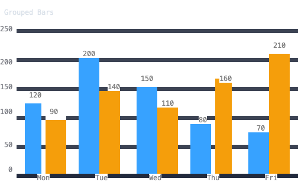 | 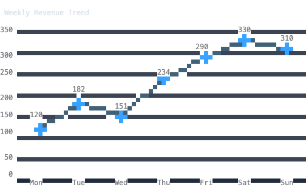 |

| Stacked Line | Scatter |
| --- | --- |
| 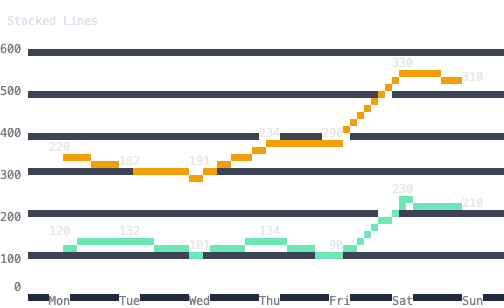 | 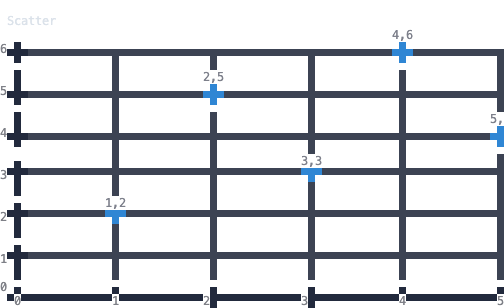 |

| Heatmap | Candlestick |
| --- | --- |
| 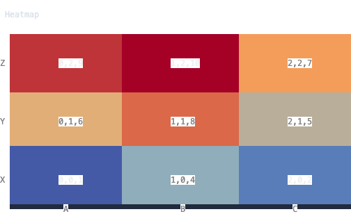 | 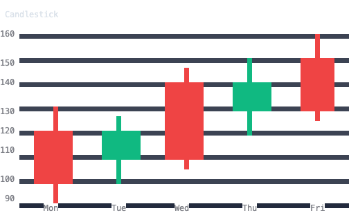 |

| Boxplot | Pictorial Bar |
| --- | --- |
| 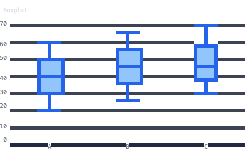 | 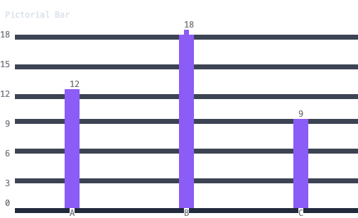 |

| Pie | Radar |
| --- | --- |
| 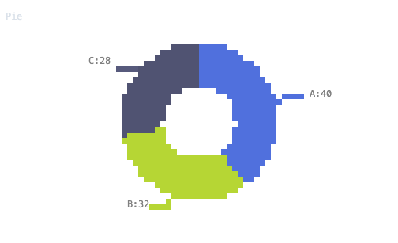 | 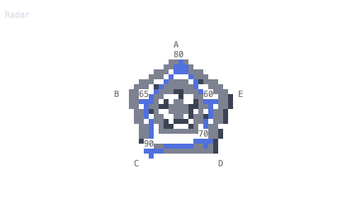 |

| Gauge | Funnel |
| --- | --- |
| 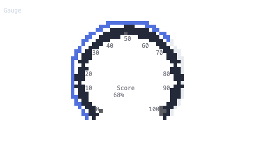 | 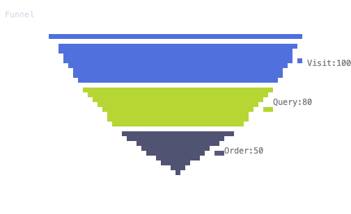 |

| Sankey | Tree |
| --- | --- |
| 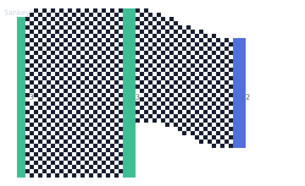 | 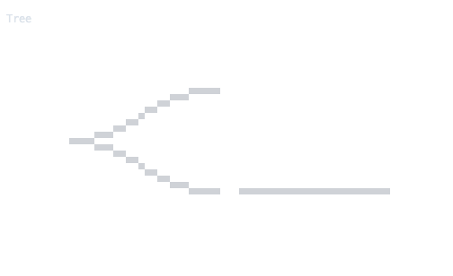 |

| Treemap | Sunburst |
| --- | --- |
| 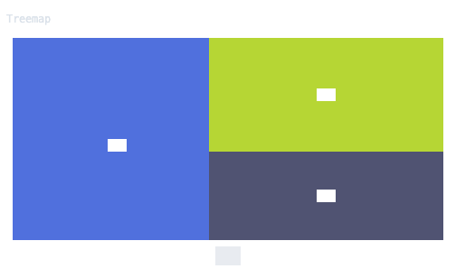 | 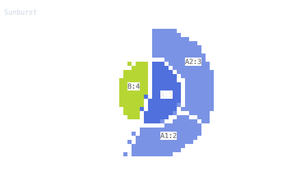 |

| Graph | Parallel |
| --- | --- |
| 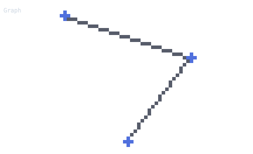 | 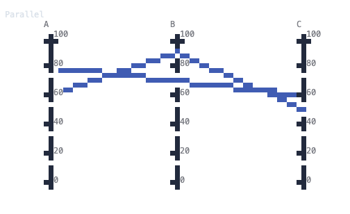 |

| Theme River | Legend Layout |
| --- | --- |
| 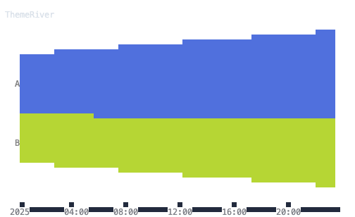 | 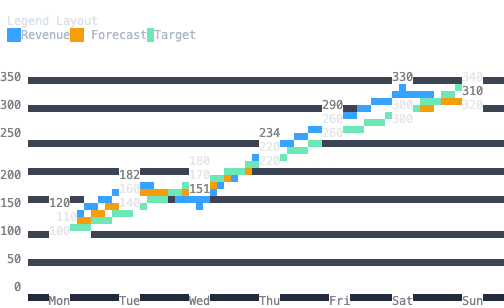 |

## Usage

```js
import * as echarts from 'echarts/core';
import { BarChart, LineChart } from 'echarts/charts';
import { GridComponent, TitleComponent } from 'echarts/components';
import {
  TerminalRenderer,
  patchECharts,
  initTerminalChart,
  createTerminalPlayer
} from 'echarts-terminal';

echarts.use([BarChart, LineChart, GridComponent, TitleComponent, TerminalRenderer]);
const terminalEcharts = patchECharts(echarts);

const chart = initTerminalChart(terminalEcharts, null, { width: 72, height: 22 });
chart.setOption({
  title: { text: 'Hello terminal' },
  xAxis: { type: 'category', data: ['A', 'B', 'C'] },
  yAxis: { type: 'value' },
  series: [{ type: 'bar', data: [3, 5, 2] }]
});

console.log(chart.renderToTerminalString());
```

## Live Updates

```js
const player = createTerminalPlayer(chart, {
  output: process.stdout
});

chart.setOption({
  title: { text: 'Tick 1' },
  xAxis: { type: 'category', data: ['A', 'B', 'C'] },
  yAxis: { type: 'value' },
  series: [{ type: 'line', data: [2, 4, 3] }]
});

chart.setOption({
  title: { text: 'Tick 2' },
  xAxis: { type: 'category', data: ['A', 'B', 'C'] },
  yAxis: { type: 'value' },
  series: [{ type: 'line', data: [4, 3, 5] }]
});

player.stop();
```

`createTerminalPlayer()` will:
- write the first frame to the target output
- rerender in place after later `setOption()` / `resize()`
- restore the cursor when `stop()` or `chart.dispose()` is called
- listen for keyboard input on TTY stdin by default

## Keyboard Interaction

When a player is attached to a real terminal, press `Enter` to enter interaction mode.

- `Left / Right`: move across data points
- `Up / Down`: switch series at the current category/index
- `Esc`: exit interaction mode

The terminal renderer will show an inline info strip with the focused data point because terminal charts do not support browser hover tooltips.

Interactive demo:

```bash
npm run showcase:interactive
```

Use `q` or `Ctrl+C` to quit the demo process.

Each patched terminal chart also gets a convenience method:

```js
const player = chart.createTerminalPlayer({
  output: process.stdout
});
```

## Live Gallery

The repo includes a terminal live showcase that cycles through `20` animated chart families, including cartesian and non-cartesian charts:

```bash
npm run showcase:live
```

## Local Development

```bash
npm run smoke:contract
npm run smoke
npm run smoke:live-gallery
npm run visual:update
npm run visual:update:tty
npm run visual:update:iterm2
npm run visual:compare:real
npm run visual:test
npm run showcase
npm run showcase:interactive
npm run showcase:live
```

## Visual Regression

The visual regression flow renders `test/terminal-compare.html` in headless Chrome,
exports each terminal frame canvas directly to PNG, syncs `docs/readme/*.png` on
update, and writes diff artifacts when the rendered output changes.

```bash
npm run visual:update
npm run visual:test
```

`visual:test` writes an HTML report to `test/visual/artifacts/latest/report.html`
so you can immediately inspect where the visual diff happened.

## Terminal.app Capture

For a real macOS terminal window capture, run:

```bash
npm run visual:update:tty
```

This drives `Terminal.app` through AppleScript, captures the live window pixels
with `screencapture`, and syncs the results into `docs/readme-terminal-app/`.
It requires macOS plus Screen Recording / Automation permission for Terminal and
your shell.

## iTerm2 Capture

For a real macOS iTerm2 window capture, run:

```bash
npm run visual:update:iterm2
```

This drives `iTerm2` through AppleScript, resizes the live session to `72x22`,
captures the real window pixels with `screencapture`, and syncs the results into
`docs/readme-iterm2/`. It requires macOS plus Screen Recording / Automation
permission for iTerm2 and your shell.

## Real Terminal Compare

To compare the current real `Terminal.app` captures against the current real
`iTerm2` captures, run:

```bash
npm run visual:compare:real
```

This writes a side-by-side report to
`test/visual/artifacts/real-terminal-compare-latest/report.html`.
